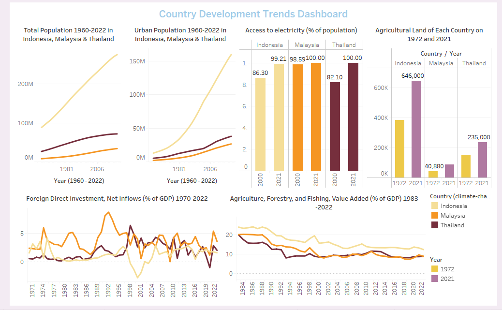
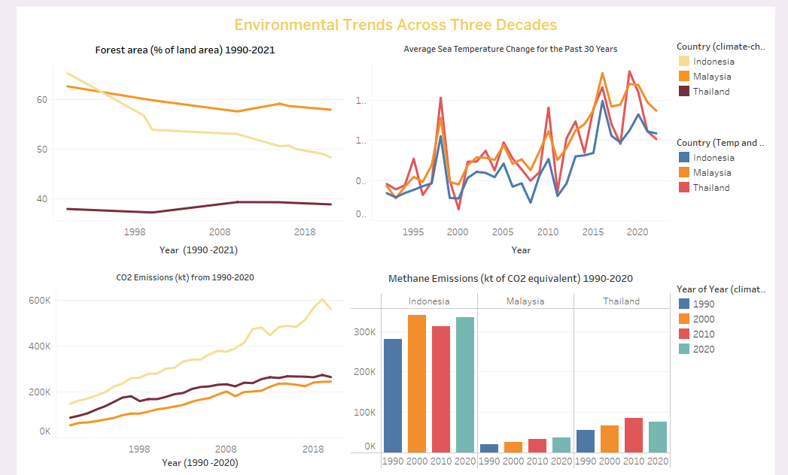
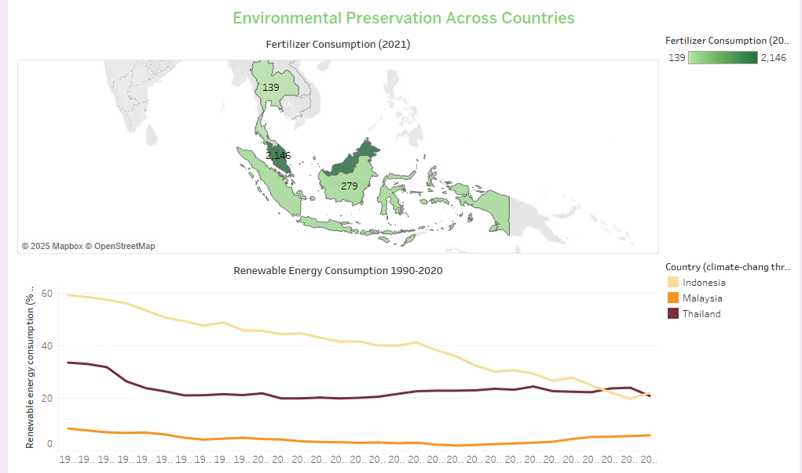

# Country Development and Environmental Health Dashboard

The analysis reveals that Indonesia stands out with the fastest population growth and significant improvements in electricity access, though its development comes with a sharp decline in forest area and rapid increases in CO₂ emissions. Malaysia demonstrates strong development indicators, such as early access to electricity and high FDI, along with moderate forest loss and relatively stable methane emissions. However, high fertilizer consumption raises concerns about sustainable agricultural practices. Thailand maintains stability across both development and environmental metrics, with steady economic growth, stable forest area, and slower increases in emissions. Its recent reduction in methane emissions also shows the improvement of environmental practices.

All in all, Thailand stands out as achieving the best balance between development and environmental preservation, with most indicators showing stable or moderate trends and no extreme spikes or declines.
